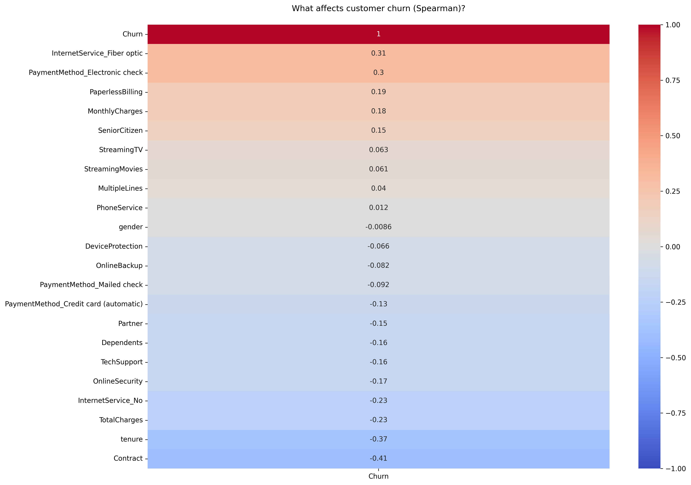
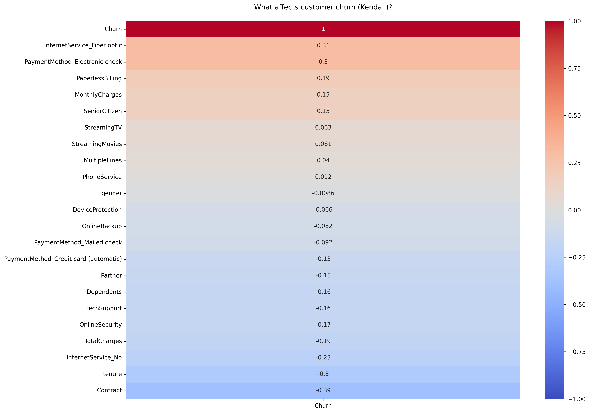
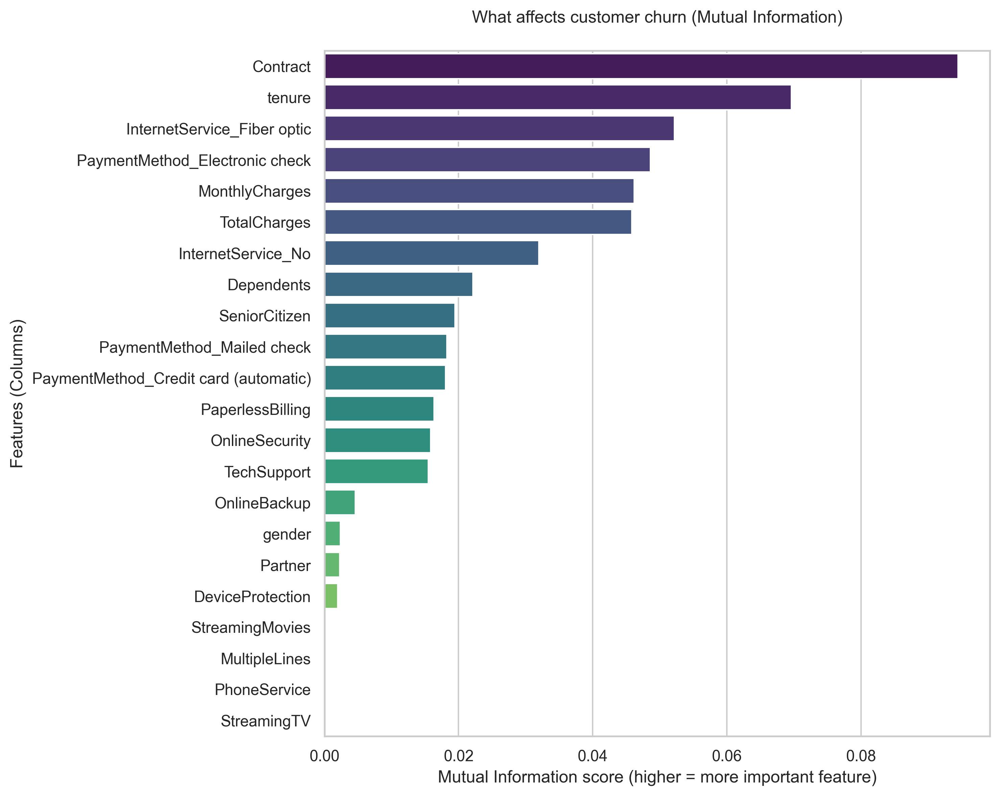
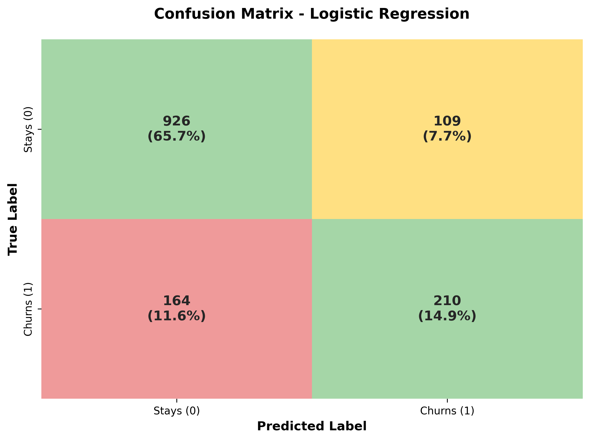
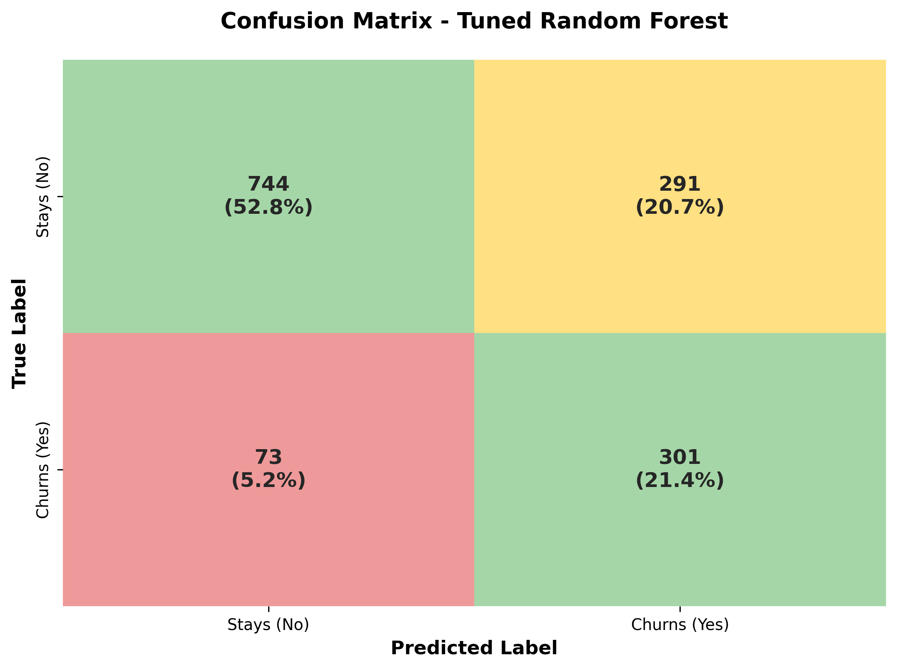

# Telco Customer Churn - Machine Learning Project


A Python machine learning project for analyzing and predicting customer churn in a telecommunications company, using the [Telco Customer Churn](https://www.kaggle.com/datasets/blastchar/telco-customer-churn) dataset from Kaggle.

## Problem Definition

This project focuses on predicting customer churn using a real-world telecom dataset. Customer churn prediction is a critical business problem that helps companies retain customers by identifying those likely to leave.

**Objective:** Predict customer churn for a telecommunications company. Customer churn refers to customers who stop using the service, which has a direct financial impact on the business.

**Evaluation:** Due to class imbalance and business priorities, recall for churned customers is treated as a primary evaluation metric—we aim to catch as many at-risk customers as possible, <u>even at the cost of some false positives</u>(<i>we prefer to over-flag (and sometimes over-act on non-churners) rather than under-flag and miss real churners</i>).

## Dataset Overview

The dataset contains customer demographic information, account details, service subscriptions, and churn status. The **target variable** is `Churn`, which indicates whether a customer has discontinued the service.

## Exploratory Data Analysis (EDA)

EDA focused on:

- Distribution of churn vs non-churn customers
- Relationship between churn and key features
- Identification of imbalance in the target variable
- Detection of patterns such as:
  - Higher churn for month-to-month contracts
  - Higher churn for customers with low tenure
  - Impact of pricing on churn behavior

Visualizations were used to support feature understanding and model decisions.

## Business Insight

The model can help the company:

- **Identify** customers at high risk of churn
- **Take** proactive retention actions (offers, support, targeted campaigns)
- **Reduce** revenue loss by focusing on high-risk segments

## Project Structure

```
telco_project_ML/
├── src/
│   ├── main.py              # Main entry point
│   ├── data_loader.py       # Data loading (download, load)
│   ├── data_analyzer.py     # EDA (report, overview)
│   ├── data_preprocessing.py# Cleaning, encoding, feature selection
│   ├── visualization.py     # Correlation, Mutual Information, confusion matrix
│   ├── model_trainer.py     # Model training, evaluation, confusion matrix plot
│   ├── utils.py             # save_to_csv (writes to data folder)
│   └── settings.py          # Constants and configuration
├── data/                    # Dataset and outputs (gitignored)
├── reports/                 # Generated reports (gitignored)
├── charts/                  # Confusion matrix and other plots
├── glossary.md              # ML terms reference
├── requirements.txt
└── README.md
```

## Setup

### 1. Create a virtual environment

```bash
# Create virtual environment
python -m venv venv

# Activate (Unix/macOS)
source venv/bin/activate

# Activate (Windows)
venv\Scripts\activate
```

### 2. Install dependencies

```bash
pip install -r requirements.txt
```

The `requirements.txt` file contains all required libraries with their versions. It will be updated as the project evolves. Each time you add a new library, add it with its version (e.g. `library_name>=1.2.0`) so others can recreate the environment exactly.

### 3. Download the Kaggle dataset

The dataset must be in the `data/` folder for the project to work. You can obtain it in either way below.

**Note:** If you prefer not to register on Kaggle or create an API key, use **Option A**—no credentials or Kaggle API setup needed. Place the CSV in `data/` and the project will use it.

#### Option A: Manual download (no Kaggle API)

1. Go to [Telco Customer Churn dataset](https://www.kaggle.com/datasets/blastchar/telco-customer-churn)
2. Sign in to your Kaggle account
3. Click the **Download** button
4. Extract the archive and place the CSV file (`WA_Fn-UseC_-Telco-Customer-Churn.csv`) in the `data/` folder

No `.env` or `kaggle.json` required.

#### Option B: Download via Kaggle API

Requires Kaggle API credentials. Use **either** `.env` or `kaggle.json`—not both.

**Using `.env` (recommended):**

1. Copy the template: `cp .env.example .env`
2. Edit `.env` and add your credentials:
   - **KAGGLE_USERNAME:** your Kaggle username
   - **KAGGLE_KEY:** your API key from [Kaggle → Settings → API → Create New Token](https://www.kaggle.com/settings)

When using `.env`, there is no need for `kaggle.json`.

**Using `kaggle.json` (alternative):**

1. Log in to Kaggle → **Settings** → **API** → **Create New Token** (downloads `kaggle.json`)
2. Place it at `~/.kaggle/kaggle.json` (macOS/Linux) or `C:\Users\<username>\.kaggle\kaggle.json` (Windows)
3. On Unix: `chmod 600 ~/.kaggle/kaggle.json`

**Download the dataset:**

```bash
kaggle datasets download -d blastchar/telco-customer-churn -p data/ --unzip
```

This creates the `data/` folder and extracts the CSV there.

## Usage

Run the main script:

```bash
python src/main.py
```

Or from the project root with module execution:

```bash
python -m src.main
```

## ML Pipeline

1. **Data loading** – Download from Kaggle, load into DataFrame
2. **Initial analysis** – Generate report, dataset overview
3. **Preprocessing** – TotalCharges fix, target encoding, drop customerID, unify categories, encode features, one-hot encoding
4. **Feature analysis** – Pearson/Spearman/Kendall correlation heatmaps, Mutual Information; `src/visualization.py` saves charts to `charts/`:

   <a href="charts/churn_correlation_pearson.png"></a>
   <a href="charts/churn_correlation_spearman.png"></a>
   <a href="charts/churn_correlation_kendall.png"></a>
   <a href="charts/mutual_information.png"></a>
5. **Feature selection** – Drop useless columns (Mutual Information)
6. **Model training** – Train and compare models, evaluate metrics
7. **Save results** – Model comparison table saved to `data/initial_model_results.csv` via `utils.save_to_csv`
8. **Confusion matrix** – Plot and print TN/FP/FN/TP for Logistic Regression:

   <p align="center">
   <a href="charts/confusion_matrix_initial_logistic_regression.png"></a>
   </p>

## Results

After initially testing four algorithms without hyperparameter tuning, the simple, linear **Logistic Regression** model proved to be the best. This indicates that following thorough data cleaning and noise removal (using Mutual Information), the underlying relationships determining customer churn are largely linear. More complex models, such as Random Forest or XGBoost, would require advanced hyperparameter tuning to beat this baseline result.

| Model | Accuracy | Recall | Precision | F1-Score |
|-------|----------|--------|-----------|----------|
| Logistic Regression | 0.8027 | 0.5535 | 0.6509 | 0.5983 |
| XGBoost | 0.7828 | 0.5160 | 0.6069 | 0.5578 |
| Decision Tree | 0.7303 | 0.5080 | 0.4922 | 0.5000 |
| Random Forest | 0.7821 | 0.4893 | 0.6120 | 0.5438 |

---

### Hyperparameter Tuning Strategy

After establishing the baseline, we will apply Hyperparameter Tuning to optimize our models. Our primary goal is to **maximize Recall** (to catch as many churning customers as possible) while maintaining a reasonable and healthy level of **Precision** (to avoid excessive false alarms). To achieve this, we will address the class imbalance and tune the following key hyperparameters for each model:

* **Logistic Regression:**
  * `C`: Controls how much the model tries to "memorize" the training data. A lower number forces the model to look at the big picture rather than getting obsessed with tiny details.
  * `penalty`: The specific math rule used to keep the model simple and prevent it from overcomplicating things.
  * `class_weight='balanced'`: Forces the model to pay extra attention to churning customers, since they are a minority in our dataset.

* **Decision Tree:**
  * `max_depth`: Limits how many questions (Yes/No rules) the tree can ask in a row. Stopping it from growing too deep prevents it from creating overly complex rules.
  * `min_samples_split`: The minimum number of customers a group must have before the tree splits it again. It stops the model from creating very specific rules for just one or two people.
  * `class_weight='balanced'`: Punishes the model much harder if it misses a churning customer.

* **Random Forest:**
  * `n_estimators`: Simply the number of trees in our forest. More trees give a better "majority vote," but take longer to calculate.
  * `max_depth`: Limits the maximum size of every single tree in the forest.
  * `class_weight='balanced'`: Ensures the whole forest takes the rare churning customers seriously.

* **XGBoost:**
  * `learning_rate`: How big of a step the model takes when learning from its mistakes. A smaller number means it learns slower but much more carefully.
  * `max_depth`: Limits the complexity of each tree it builds.
  * `scale_pos_weight`: XGBoost's own version of the "pay attention to the minority" rule. It balances the scales between the people who stay and the people who leave.

### Results After Hyperparameter Tuning (Grid Search)

Tuning was optimized for **Recall** to catch as many churning customers as possible:

| Model | Accuracy | Recall | Precision | F1-Score | Best Params |
|-------|----------|--------|-----------|----------|-------------|
| XGBoost | 0.6274 | **0.9305** | 0.4109 | 0.5700 | learning_rate=0.01, max_depth=3, scale_pos_weight=5 |
| Decision Tree | 0.7488 | 0.8048 | 0.5172 | 0.6297 | max_depth=5, min_samples_split=2, class_weight='balanced' |
| Random Forest | 0.7417 | 0.8048 | 0.5084 | 0.6232 | max_depth=5, n_estimators=50, class_weight='balanced' |
| Logistic Regression | 0.7331 | 0.7968 | 0.4983 | 0.6132 | C=0.1, class_weight='balanced', penalty='l2' |

### 📊 Hyperparameter Tuning Results & Business Insights

After running `GridSearchCV` to optimize our models for **Recall**, we gained several crucial business and technical insights:

**1. The XGBoost Trap (The "Paranoid Guard" Effect)**
While XGBoost achieved an outstanding Recall of 93%, its Precision plummeted to 41%, and overall Accuracy dropped to 62%. 
* **Why?** The `scale_pos_weight: 5` parameter forced the model to treat churning customers as 5 times more important than loyal ones. The model acted like a paranoid security guard—it caught almost every leaving customer, but generated a massive amount of false alarms. In a real business scenario, this would lead to financial losses by giving away retention discounts to customers who never intended to leave.

**2. The True Winners: Decision Tree & Random Forest (The Sweet Spot)**
Decision Tree and Random Forest emerged as the most balanced and practical models, leading with the highest F1-Score (~63%). 
* **Recall skyrocketed to ~80%** (a massive leap from our 55% baseline!).
* **Precision stabilized at ~51%** (an acceptable and manageable business risk).
These models found the ideal compromise: we successfully identify 8 out of 10 churning customers while keeping false alarms under control.

**3. Class Balancing Worked Perfectly**
As strategically planned, we paid a small "tax" in overall Accuracy (which dropped from ~80% to ~74%). By utilizing the `class_weight='balanced'` parameter, we forced the algorithms to stop "lazily" predicting the majority class (loyal customers). We deliberately sacrificed raw, misleading accuracy to maximize actual business value (Recall).

**4. Simplicity Over Complexity (Preventing Overfitting)**
The `GridSearchCV` automation consistently selected simpler configurations, proving that overly complex models are not always better:
* Tree-based models capped at `max_depth: 5`, refusing to build deep, overly complicated rules.
* Logistic Regression selected `C: 0.1` (strong regularization), meaning it preferred a generalized, simple approach to avoid overfitting on the training data.

---

### 🎯 Final Project Conclusion

Our initial Logistic Regression baseline provided a solid general foundation. However, by strategically applying hyperparameter tuning and addressing class imbalance, we successfully aligned the algorithms with our primary business goal. 

The tuned **Decision Tree** and **Random Forest** models proved to be the most effective, dramatically **increasing our churn detection rate (Recall) from a baseline of 55% to an impressive 80%**. This translates directly into actionable business value, allowing the telecom company to proactively target and retain significantly more at-risk customers without wasting the marketing budget on false alarms.

<p align="center">
  <a href="charts/confusion_matrix_tuned_random_forest.png"></a>
</p>

## Final Evaluation

This project demonstrates a complete and realistic machine learning pipeline, from data understanding to business-driven model optimization.

## Development Notes

- The project uses `.py` files only (no Jupyter notebooks)
- Run and test code via the Python console or by executing scripts
- `glossary.md` explains ML terms used in the project

## Dataset Reference

- **Source:** [Telco Customer Churn | Kaggle](https://www.kaggle.com/datasets/blastchar/telco-customer-churn)
- **Author:** blastchar
- **License:** Database: Open Database, Contents: Database Contents
