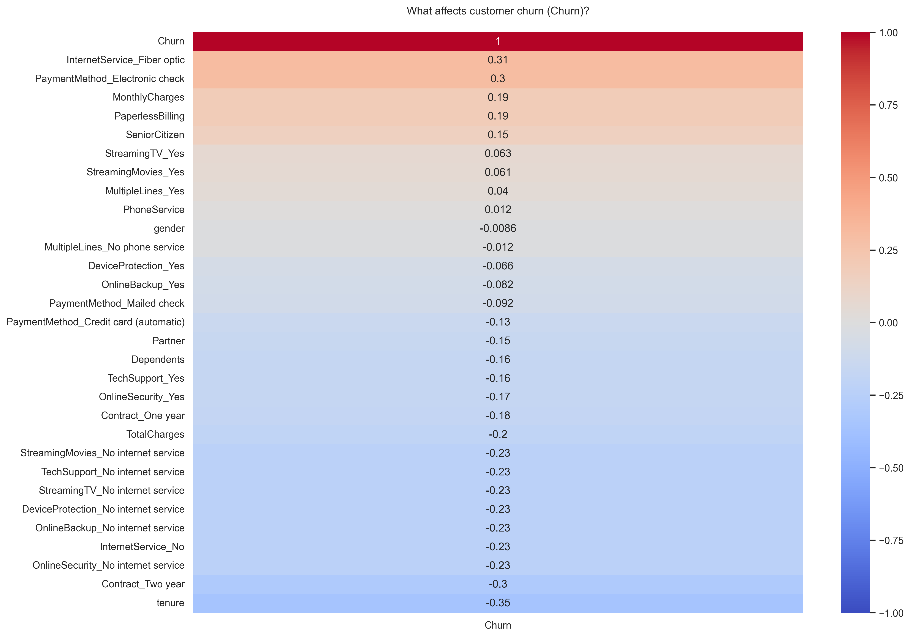
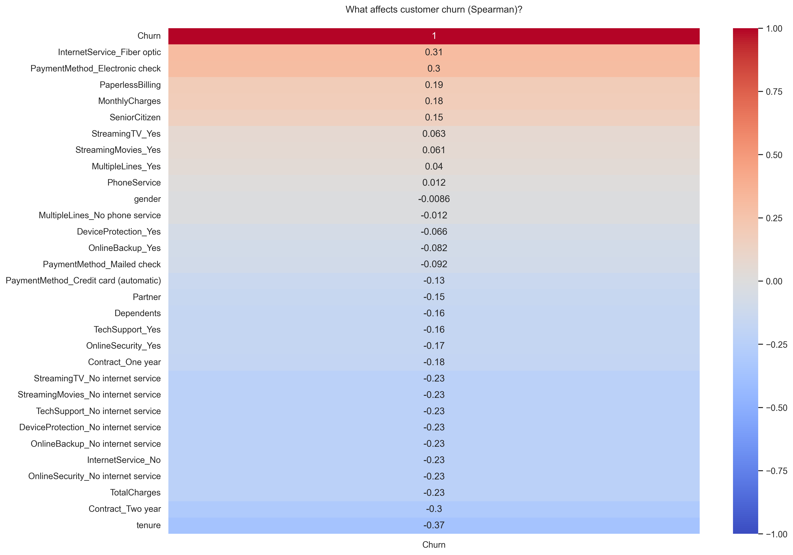
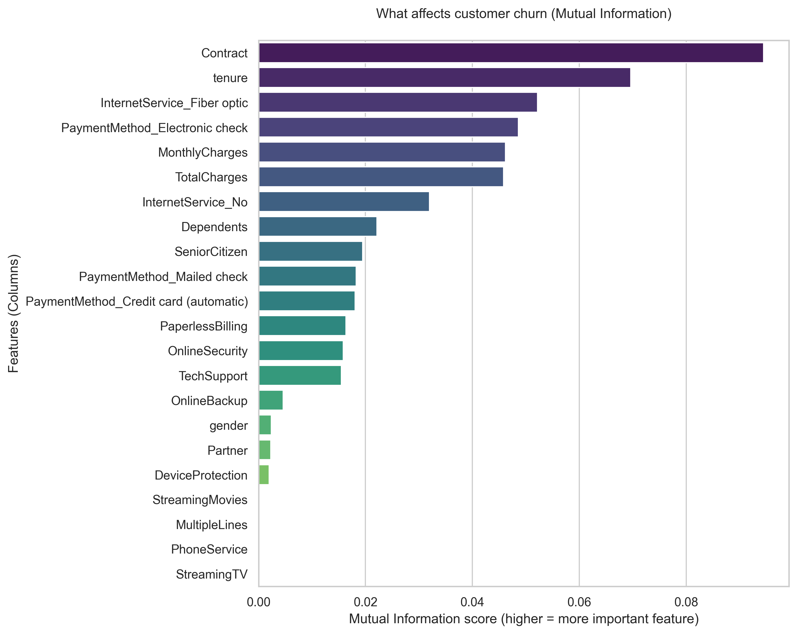
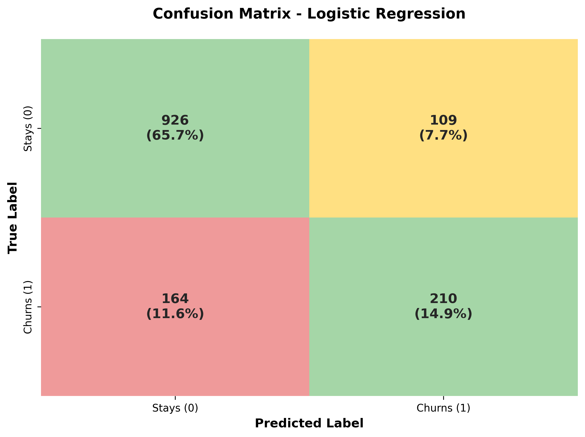
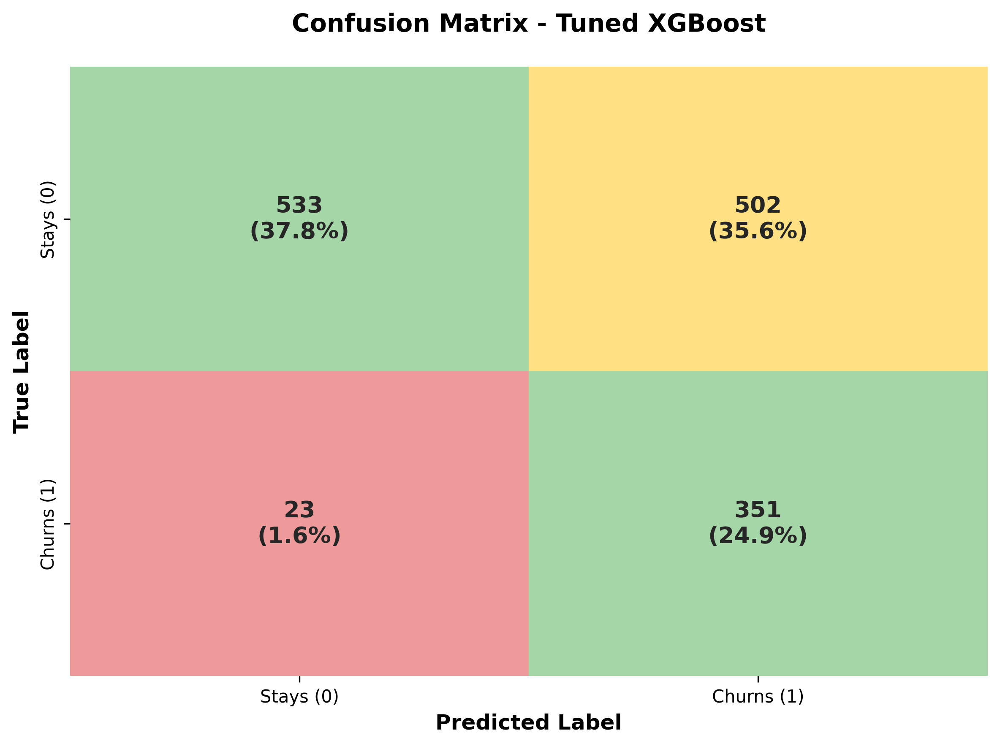
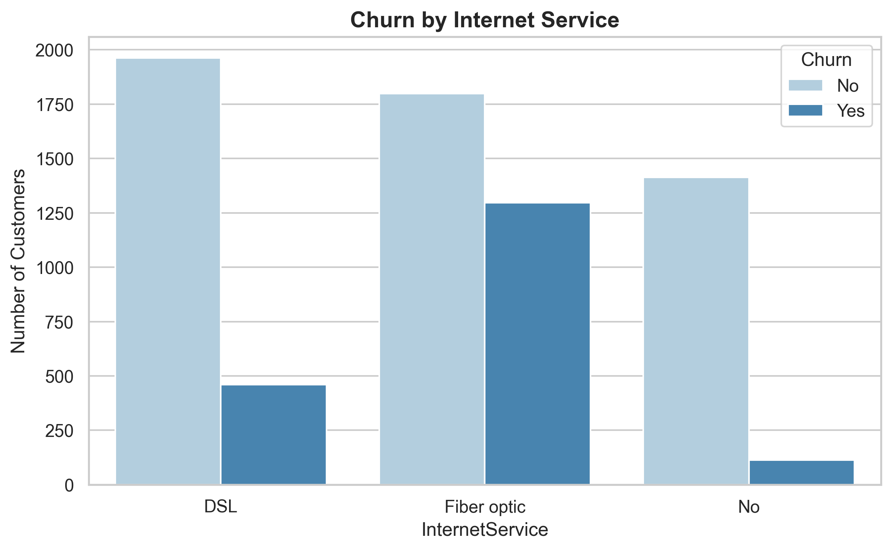
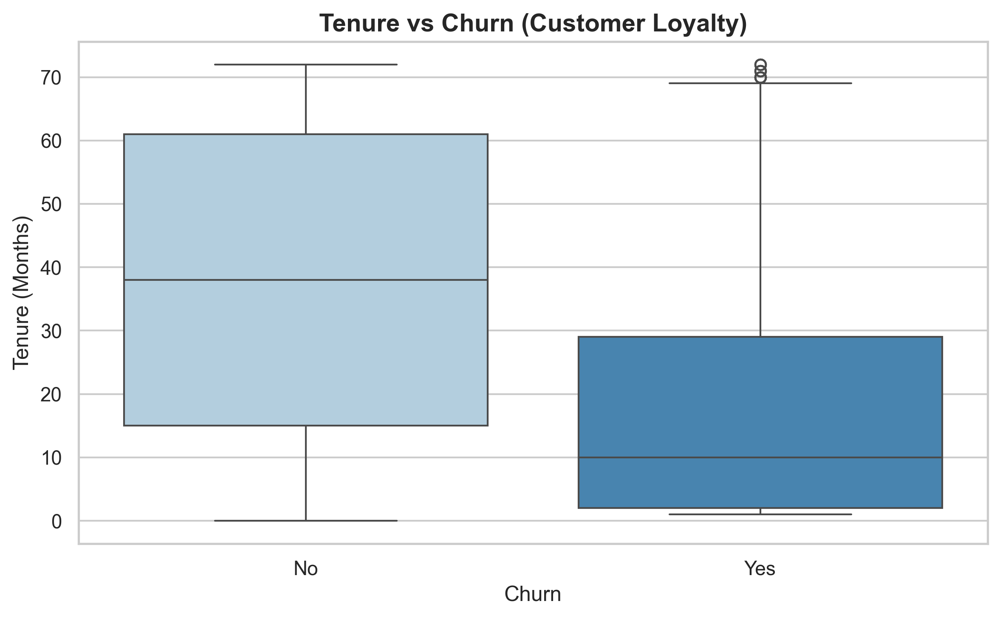
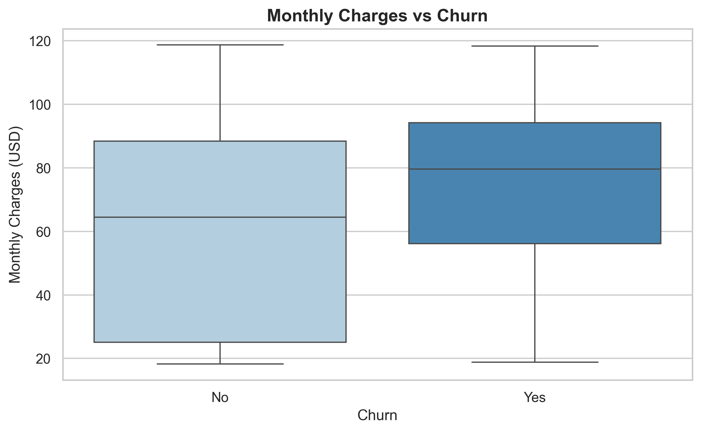
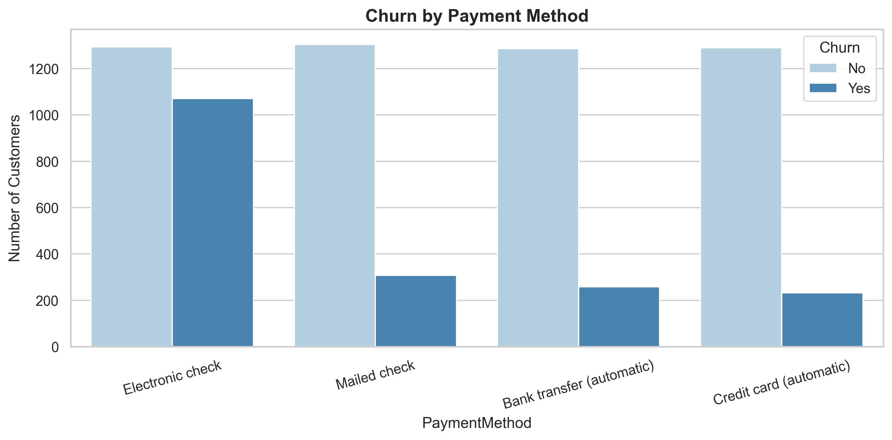

# Telco Customer Churn - Machine Learning Project


A Python machine learning project for analyzing and predicting customer churn in a telecommunications company, using the [Telco Customer Churn](https://www.kaggle.com/datasets/blastchar/telco-customer-churn) dataset from Kaggle.

## Problem Definition

This project focuses on predicting customer churn using a real-world telecom dataset. Customer churn prediction is a critical business problem that helps companies retain customers by identifying those likely to leave.

**Objective:** Predict customer churn for a telecommunications company. Customer churn refers to customers who stop using the service, which has a direct financial impact on the business.

**Evaluation:** Due to class imbalance and business priorities, recall for churned customers is treated as a primary evaluation metric—we aim to catch as many at-risk customers as possible, <u>even at the cost of some false positives</u>(<i>we prefer to over-flag (and sometimes over-act on non-churners) rather than under-flag and miss real churners</i>).

## Dataset Overview

The dataset contains customer demographic information, account details, service subscriptions, and churn status. The **target variable** is `Churn`, which indicates whether a customer has discontinued the service.

## Exploratory Data Analysis (EDA)

EDA focused on:

- Distribution of churn vs non-churn customers
- Relationship between churn and key features
- Identification of imbalance in the target variable
- Detection of patterns such as:
  - Higher churn for month-to-month contracts
  - Higher churn for customers with low tenure
  - Impact of pricing on churn behavior

Visualizations were used to support feature understanding and model decisions.

## Business Insight

The model can help the company:

- **Identify** customers at high risk of churn
- **Take** proactive retention actions (offers, support, targeted campaigns)
- **Reduce** revenue loss by focusing on high-risk segments

## Project Structure

```
telco_project_ML/
├── src/
│   ├── main.py              # Main entry point
│   ├── data_loader.py       # Data loading (download, load)
│   ├── data_analyzer.py     # EDA (report, overview)
│   ├── data_preprocessing.py# Cleaning, encoding, feature selection
│   ├── visualization.py     # Correlation, Mutual Information, confusion matrix
│   ├── model_trainer.py     # Model training, evaluation, confusion matrix plot
│   ├── utils.py             # save_to_csv, get_best_params
│   └── settings.py          # Constants and configuration
├── data/                    # Dataset and results CSVs
├── reports/                 # Generated HTML reports
├── charts/
│   ├── eda/                 # EDA charts (contract, internet, tenure, charges, payment)
│   └── correlation/         # Correlation heatmaps (pearson, spearman, kendall)
├── glossary.md              # ML terms reference
├── project_description.md  # Step-by-step project walkthrough
├── requirements.txt
└── README.md
```

## Setup

### 1. Create a virtual environment

```bash
# Create virtual environment
python -m venv venv

# Activate (Unix/macOS)
source venv/bin/activate

# Activate (Windows)
venv\Scripts\activate
```

### 2. Install dependencies

```bash
pip install -r requirements.txt
```

The `requirements.txt` file contains all required libraries with their versions. It will be updated as the project evolves. Each time you add a new library, add it with its version (e.g. `library_name>=1.2.0`) so others can recreate the environment exactly.

### 3. Download the Kaggle dataset

The dataset must be in the `data/` folder for the project to work. You can obtain it in either way below.

**Note:** If you prefer not to register on Kaggle or create an API key, use **Option A**—no credentials or Kaggle API setup needed. Place the CSV in `data/` and the project will use it.

#### Option A: Manual download (no Kaggle API)

1. Go to [Telco Customer Churn dataset](https://www.kaggle.com/datasets/blastchar/telco-customer-churn)
2. Sign in to your Kaggle account
3. Click the **Download** button
4. Extract the archive and place the CSV file (`WA_Fn-UseC_-Telco-Customer-Churn.csv`) in the `data/` folder

No `.env` or `kaggle.json` required.

#### Option B: Download via Kaggle API

Requires Kaggle API credentials. Use **either** `.env` or `kaggle.json`—not both.

**Using `.env` (recommended):**

1. Copy the template: `cp .env.example .env`
2. Edit `.env` and add your credentials:
   - **KAGGLE_USERNAME:** your Kaggle username
   - **KAGGLE_KEY:** your API key from [Kaggle → Settings → API → Create New Token](https://www.kaggle.com/settings)

When using `.env`, there is no need for `kaggle.json`.

**Using `kaggle.json` (alternative):**

1. Log in to Kaggle → **Settings** → **API** → **Create New Token** (downloads `kaggle.json`)
2. Place it at `~/.kaggle/kaggle.json` (macOS/Linux) or `C:\Users\<username>\.kaggle\kaggle.json` (Windows)
3. On Unix: `chmod 600 ~/.kaggle/kaggle.json`

**Download the dataset:**

```bash
kaggle datasets download -d blastchar/telco-customer-churn -p data/ --unzip
```

This creates the `data/` folder and extracts the CSV there.

## Usage

Run the main script:

```bash
python src/main.py
```

Or from the project root with module execution:

```bash
python -m src.main
```

## ML Pipeline

1. **Data loading** – Download from Kaggle, load into DataFrame
2. **Initial analysis** – Generate report, dataset overview
3. **Business insights (EDA)** – 5 charts showing root causes of churn, saved to `charts/eda/`
4. **Preprocessing** – TotalCharges fix, target encoding, drop customerID, unify categories, encode features, one-hot encoding
5. **Feature analysis** – Pearson/Spearman/Kendall correlation heatmaps saved to `charts/correlation/`, Mutual Information saved to `charts/`:

   <a href="charts/correlation/churn_correlation_pearson.png"></a>
   <a href="charts/correlation/churn_correlation_spearman.png"></a>
   <a href="charts/correlation/churn_correlation_kendall.png"></a>
   <a href="charts/mutual_information.png"></a>
6. **Feature selection** – Drop useless columns based on Mutual Information scores
7. **Train-test split** – 80/20 split with stratification
8. **Model training** – Train and compare 4 models, results saved to `data/initial_model_results.csv`
9. **Confusion matrix (Logistic Regression)** – Plot TN/FP/FN/TP for the initial winner:

   <p align="center">
   <a href="charts/confusion_matrix_initial_logistic_regression.png"></a>
   </p>

10. **Hyperparameter tuning** – GridSearchCV optimizing for Recall, results saved to `data/tuned_model_results.csv`
11. **Confusion matrix (Tuned XGBoost)** – Plot TN/FP/FN/TP for the tuned winner:

    <p align="center">
    <a href="charts/confusion_matrix_tuned_xgboost.png"></a>
    </p>

12. **Business impact simulation** – Compare financial ROI of baseline vs tuned model

---

### 🔍 Root Cause Analysis: Why Are Customers Leaving?

Building a Machine Learning model helps us catch churning customers, but understanding *why* they leave allows the business to fix the root cause. Based on our Exploratory Data Analysis (Correlation and Mutual Information metrics), we identified the primary drivers behind customer churn and prepared the following strategic recommendations:

* **1. Contract Type (The "Month-to-Month" Trap)**
    * **The Issue:** Customers on month-to-month contracts are by far the most likely to leave. They have no long-term commitment and can easily switch to competitors at a moment's notice.
    * **Recommendation:** Aggressively incentivize 1-year or 2-year contracts. Offer attractive upgrades, free streaming services, or loyalty discounts to lock customers into longer terms.

   <p align="center"><a href="charts/eda/eda_1_contract.png"></a></p>

* **2. Internet Service (The "Fiber Optic" Problem)**
    * **The Issue:** Surprisingly, customers with Fiber Optic internet show a remarkably high churn rate compared to DSL users. 
    * **Recommendation:** This requires immediate business investigation. The company must check if the Fiber Optic service is overpriced, technically unstable (frequent outages), or if a local competitor is actively undercutting our prices.

   <p align="center"><a href="charts/eda/eda_2_internet.png"></a></p>

* **3. Tenure (The "First Impression" Matters)**
    * **The Issue:** New customers (low tenure) have the highest probability of leaving. However, if a customer stays with the company for the first few months, they tend to become highly loyal.
    * **Recommendation:** Revamp the customer onboarding experience. Provide exceptional, proactive technical support and welcome bonuses during the first 3 to 6 critical months.

   <p align="center"><a href="charts/eda/eda_3_tenure.png"></a></p>

* **4. Monthly Charges (Price Sensitivity)**
    * **The Issue:** There is a strong correlation between high monthly bills and churn. Customers feel the financial pinch and look for cheaper alternatives.
    * **Recommendation:** Review the pricing strategy for premium packages. Use our newly built Machine Learning model to proactively offer personalized, temporary discounts to high-bill customers who are flagged as "high risk."

   <p align="center"><a href="charts/eda/eda_4_charges.png"></a></p>

* **5. Payment Method (The "Electronic Check" Friction)**
    * **The Issue:** Customers paying via Electronic Check churn significantly more often than those using automatic credit card payments or bank transfers. Manual payments force customers to actively think about their bill every month.
    * **Recommendation:** Remove the friction. Encourage customers to switch to automated payments (Auto-Pay) by offering a small, permanent monthly discount (e.g., $5 off).

   <p align="center"><a href="charts/eda/eda_5_payment.png"></a></p>

---

## Results

After initially testing four algorithms without hyperparameter tuning, the simple, linear **Logistic Regression** model proved to be the best across all 4 metrics.

| Model | Accuracy | Recall | Precision | F1-Score |
|-------|----------|--------|-----------|----------|
| **Logistic Regression** | **0.8027** | **0.5535** | **0.6509** | **0.5983** |
| XGBoost | 0.7828 | 0.5160 | 0.6069 | 0.5578 |
| Decision Tree | 0.7303 | 0.5080 | 0.4922 | 0.5000 |
| Random Forest | 0.7821 | 0.4893 | 0.6120 | 0.5438 |

---

### Hyperparameter Tuning Strategy

After establishing the baseline, we applied `GridSearchCV` to optimize all 4 models for **Recall** (catching as many churners as possible). To address class imbalance, `class_weight='balanced'` was used for all sklearn models and `scale_pos_weight` for XGBoost.

Key hyperparameters tuned for each model:

* **Logistic Regression:**
  * `C`: Regularization strength — low C = simpler model (ignores noise), high C = fits training data closely (risk of overfitting)
  * `class_weight='balanced'`: Forces the model to pay extra attention to churning customers (minority class)

* **Decision Tree:**
  * `max_depth`: How deep the tree can grow — prevents overfitting by limiting complexity
  * `min_samples_split`: Minimum samples required to split a node — stops the model creating rules for just 1-2 customers
  * `class_weight='balanced'`: Penalizes the model harder for missing churners

* **Random Forest:**
  * `n_estimators`: Number of trees in the forest — more trees = more stable "majority vote"
  * `max_depth`: Limits the depth of each individual tree
  * `class_weight='balanced'`: Ensures the whole forest takes minority class seriously

* **XGBoost:**
  * `learning_rate`: How fast the model learns (smaller = slower but more accurate)
  * `max_depth`: Limits the complexity of each tree
  * `scale_pos_weight`: XGBoost's equivalent of `class_weight='balanced'` — value = count(No) / count(Yes) ≈ 3

### Results After Hyperparameter Tuning (Grid Search)

| Model | Accuracy | Recall | Precision | F1-Score | Best Params |
|-------|----------|--------|-----------|----------|-------------|
| **XGBoost** | 0.6274 | **0.9305** | 0.4109 | 0.5700 | learning_rate=0.01, max_depth=3, scale_pos_weight=5 |
| Decision Tree | 0.7488 | 0.8048 | 0.5172 | 0.6297 | max_depth=5, min_samples_split=2, class_weight=balanced |
| Random Forest | 0.7417 | 0.8048 | 0.5084 | 0.6232 | max_depth=5, n_estimators=50, class_weight=balanced |
| Logistic Regression | 0.7331 | 0.7968 | 0.4983 | 0.6132 | C=0.1, class_weight=balanced |

**XGBoost wins on Recall (0.93)** — catches 93 out of every 100 real churners. The trade-off is lower Precision (0.41) and more false alarms, but in telecom a missed churner costs full LTV=$1000 while a false alarm costs only a $100 discount — making this trade-off well worth it.

---

### 🎯 Final Project Conclusion

By strategically applying hyperparameter tuning and addressing class imbalance, we successfully aligned the models with our primary business goal — **maximizing Recall**.

The tuned **XGBoost** model dramatically increased our churn detection rate from **55% → 93%**, reducing missed churners from 164 to just 23 on the test set.

### 💰 Business Value & ROI Simulation

| | Logistic Regression | Tuned XGBoost |
|---|---|---|
| Retained customers (TP) | 210 → profit $189,000 | 351 → profit $315,900 |
| False alarms (FP) | 109 → loss $10,900 | 502 → loss $50,200 |
| Missed churners (FN) | 164 → loss $164,000 | 23 → loss $23,000 |
| **Net profit** | **$14,100** | **$242,700** |

**Tuned XGBoost brings $228,600 more profit** on this test sample alone. The key driver is FN dropping from 164 → 23 — each missed churner costs full LTV=$1,000.

---

## Final Evaluation

This project demonstrates a complete and realistic machine learning pipeline, from data understanding to business-driven model optimization.

## Development Notes

- The project uses `.py` files only (no Jupyter notebooks)
- Run and test code via the Python console or by executing scripts
- `glossary.md` explains ML terms used in the project

## Dataset Reference

- **Source:** [Telco Customer Churn | Kaggle](https://www.kaggle.com/datasets/blastchar/telco-customer-churn)
- **Author:** blastchar
- **License:** Database: Open Database, Contents: Database Contents
